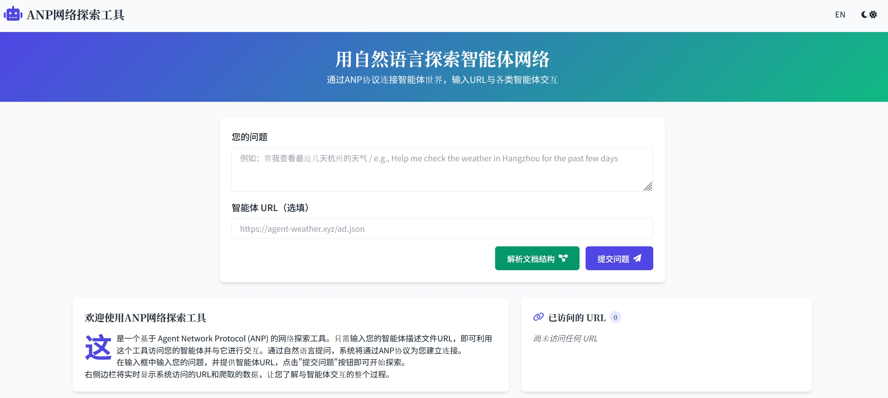
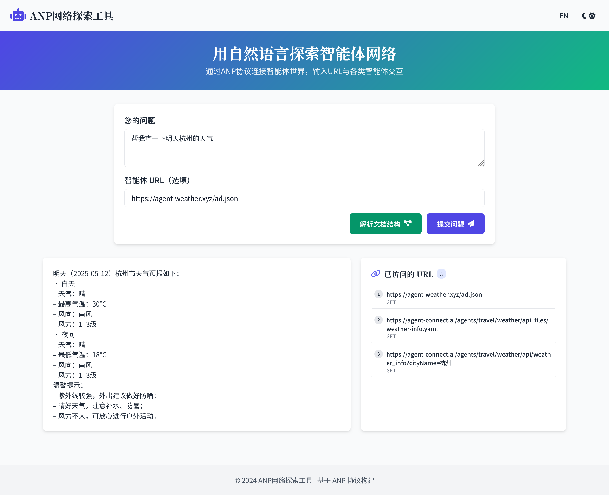
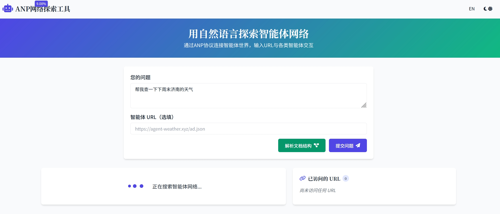
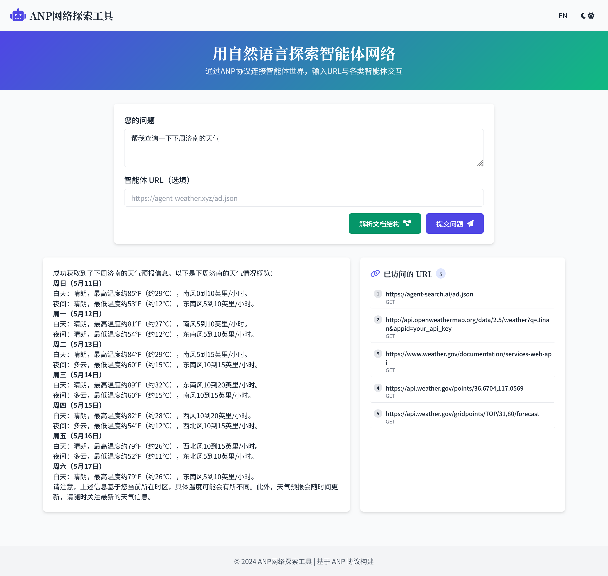

# ANP网络探索工具 / ANP Network Explorer

[English](#english) | [中文](#chinese)

<a name="chinese"></a>
## 中文文档

### 项目介绍

ANP网络探索工具是一个基于Agent Network Protocol (ANP)的应用程序，允许用户使用自然语言与智能体网络进行交互。用户可以提供智能体描述URL，通过简单的问题与智能体进行对话，并实时查看网络爬取的过程。


### 项目结构

本项目包含以下主要组件：

- **web_app/**：Web应用程序，包含前端和后端实现
  - **frontend/**：基于HTML/JavaScript的用户界面
  - **backend/**：基于FastAPI的后端服务器
  - **static/**：静态资源文件

- **anp_examples/**：ANP核心功能实现
  - **simple_example.py**：简化的ANP爬取逻辑实现
  - **anp_tool.py**：ANP工具类，用于与智能体网络交互
  - **utils/**：工具类和辅助函数

- **use_did_test_public/**：DID认证相关文件
  - **did.json**：DID文档
  - **key-1_private.pem**：私钥文件
  - **private_keys.json**：密钥配置

- **examples_code/**：示例代码
  - **client.py**：客户端示例
  - **server.py**：服务器示例
  - **did_auth_middleware.py**：DID认证中间件
  - **jwt_config.py**：JWT配置

### 如何运行（面向体验用户）

#### 环境设置

在运行项目之前，你需要设置必要的环境变量。项目中提供了一个 `.env.example` 文件作为模板：

1.  复制 `.env.example` 文件并重命名为 `.env`：
    ```bash
    cp .env.example .env
    ```
2.  编辑 `.env` 文件，填入你的 API-KEY 和 Endpoint 等实际配置信息。

#### 使用Web应用程序

##### 方法一：通过浏览器直接运行
通过访问我们部署在WEB端的应用程序，你可以直接体验ANP网络探索工具的功能。
[访问网址:Https://service.agent-network-protocol.com/anp-demo/](https://service.agent-network-protocol.com/anp-demo/)


##### 方法二：使用脚本运行
通过以下步骤，你可以在本地运行Web应用程序。

1. 安装依赖：
   ```bash
   # 使用Poetry
   poetry install
   
   # 或使用pip
   pip install -r web_app/backend/requirements.txt
   ```

2. 启动Web应用程序：
   
   方式一：运行脚本
   ```bash
   # 使用Poetry
   ./web_app/run_with_poetry.sh
   
   # 或使用脚本
   ./web_app/run.sh
   ```
   方式二：运行代码
   ```bash
   python /anp-examples/web_app/backend/anp_examples_backend.py
   ```

3. 打开浏览器访问：`http://localhost:5000`

4. 在输入框中输入您的问题，并提供智能体URL（可选，默认为`https://agent-search.ai/ad.json`）

5. 点击"提交问题"按钮


1. 查看结果和网络爬取过程


### 如何开发（面向开发者）

1. 克隆仓库：
   ```bash
   git clone https://github.com/yourusername/anp-examples.git
   cd anp-examples
   ```
2. 安装开发依赖：
   ```bash
   poetry install
   
   # 或使用pip
   pip install -r web_app/backend/requirements.txt
   ```

3. 运行测试：
   ```bash
   python /anp-examples/web_app/backend/anp_examples_backend.py
   ```

4. 观察日志：


---

<a name="english"></a>
## English Documentation

### Project Introduction

ANP Network Explorer is an application based on the Agent Network Protocol (ANP) that allows users to interact with agent networks using natural language. Users can provide agent description URLs, engage in conversations with agents through simple questions, and view the network crawling process in real-time.


### Project Structure

This project contains the following main components:

- **web_app/**: Web application, including frontend and backend implementations
  - **frontend/**: HTML/JavaScript-based user interface
  - **backend/**: FastAPI-based backend server
  - **static/**: Static resource files

- **anp_examples/**: ANP core functionality implementation
  - **simple_example.py**: Simplified ANP crawling logic
  - **anp_tool.py**: ANP tool class for interacting with agent networks
  - **utils/**: Utility classes and helper functions

- **use_did_test_public/**: DID authentication related files
  - **did.json**: DID document
  - **key-1_private.pem**: Private key file
  - **private_keys.json**: Key configuration

- **examples_code/**: Example code
  - **client.py**: Client example
  - **server.py**: Server example
  - **did_auth_middleware.py**: DID authentication middleware
  - **jwt_config.py**: JWT configuration

### How to run (for experiential users)

#### Environment Setup

Before running the project, you need to set up the necessary environment variables. An `.env.example` file is provided as a template:

1.  Copy the `.env.example` file and rename it to `.env`:
    ```bash
    cp .env.example .env
    ```
2.  Edit the `.env` file and fill in your actual Azure OpenAI API Key, Endpoint, and other configuration details.

#### Using the Web Application

##### Mode A: Run directly through a browser
By accessing our application deployed on the web side, you can directly experience the functionality of ANP network exploration tool.
[Visit website : Https://service.agent-network-protocol.com/anp-demo/](https://service.agent-network-protocol.com/anp-demo/)


##### Mode B：Use script to run
By following these steps, you can run a web application locally.

1. Install dependencies:
   ```bash
   # Using Poetry
   poetry install
   
   # Or using pip
   pip install -r web_app/backend/requirements.txt
   ```

2. Start the web application:
   Mode A : Run script
   ```bash
   # Using Poetry
   ./web_app/run_with_poetry.sh
   
   # Or using script
   ./web_app/run.sh
   ```
      Mode B : Run code
   ```bash
   python /anp-examples/web_app/backend/anp_examples_backend.py
   ```

3. Open browser and visit: `http://localhost:8000`

4. Enter your question in the input box and provide an agent URL (optional, default is `https://agent-search.ai/ad.json`)

5. Click the "Submit" button 


6. view results and the network crawling process


### How to Develop (for Developers)

1. Clone the repository:
   ```bash
   git clone https://github.com/yourusername/anp-examples.git
   cd anp-examples
   ```

2. Install development dependencies:
   ```bash
   poetry install
   
   # 或使用pip
   pip install -r web_app/backend/requirements.txt
   ```

3. Run tests:
   ```bash
   python /anp-examples/web_app/backend/anp_examples_backend.py
   ```
4. Observe logs:

